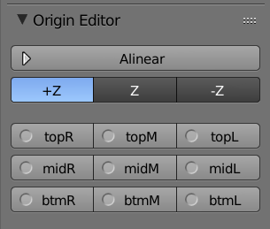
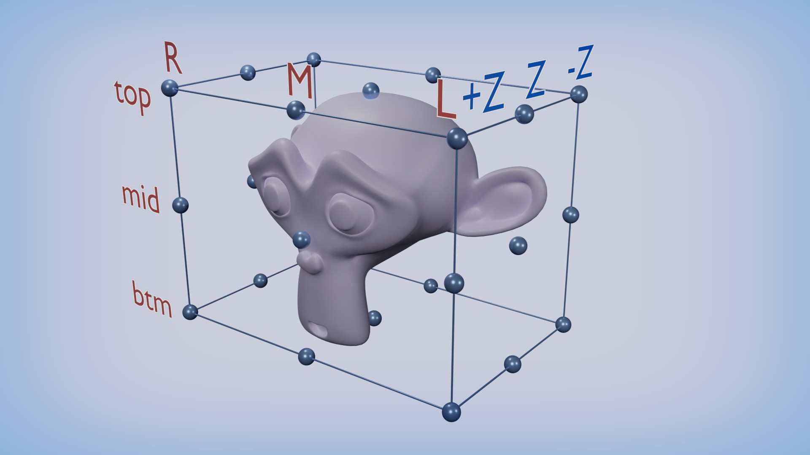
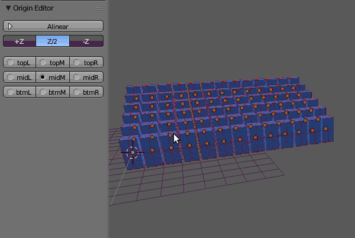

# Origin Editor
Addon de Blender para modificar el origen de varios objetos seleccionados. Muy útil para Motion Graphics.

La Interface es simple, tres grupos de botones:

El primer botón ejecuta el script.

El segundo grupo de botones definen si el origen se alinea al frente, al medio o detrás del objeto.

Y el último grupo de botones definen en que parte de lado a lado y de arriba a abajo se situará el origen.

## Observaciones
Debido a ciertas limitaciones temporales, para que el addon funcione se necesita que los objetos seleccionados tengan la orientación en 0.